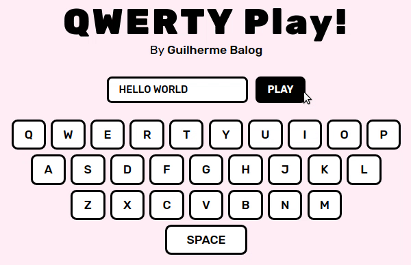
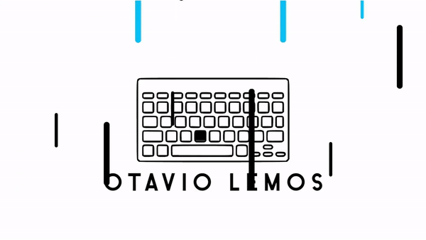

# QWERTY Play

⌨️ Aplicação que simula digitação num teclado virtual. Disponível em [guilhermebalog.ga/qwerty-play](https://guilhermebalog.ga/qwerty-play)

**Dica:** Você pode o passar texto a pela URL com o parâmetro `q`, por exemplo: [guilhermebalog.ga/qwerty-play/?q=follow me](https://guilhermebalog.ga/qwerty-play/?q=follow%20me)

Inspirado na abertura do canal do professor [Otavio Lemos](https://www.youtube.com/channel/UC9cOiXh-RFR7KI61KcyTb0g):

